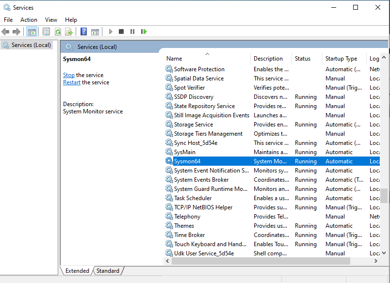
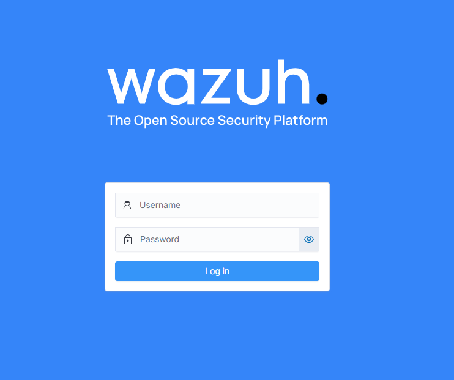

# **SOC Automation Project Setup**

# **1. Install and Configure WIndows 10 Machine with Sysmon**
## **1.1. WIndows 10 Machine Installation**

In this project we will install Windows 10 Machine on VirtualBox

## **1.2. Install and Configure Sysmon on Windows 10 Machine**

### **1.2.1. Download and Install** 
[SYSMON](https://learn.microsoft.com/en-us/sysinternals/downloads/sysmon)

### **1.2.2. Download Sysmon Configuration Files** 
[Sysmon Modular Config](https://github.com/olafhartong/sysmon-modular)

### **1.2.3. Extract the Sysmon zip file and move the Sysmon config file to the extracted Sysmon zip folder** 

### **1.2.4. Install and Check Service, Event Viewer to Ensure Sysmon Was Installed Correctly** 

# **2. Setup Wazuh Server**

In this project we will depoy Wazuh server on Cloud Services (DigitalOcean)

TheHive Installation Workflow:
 - Create Wazuh Droplet
 - Update and Upgrade the System
 - Install Wazuh

## **2.1. Create a Droplet on DigitalOcean and Choose the Operating System:**

In this project we will choose Ubuntu Machine

### **2.1.1 Set Up Firewall:**
we need a firewall to prevent unauthorized access and external scan spams by modifying the inbound rules to allow access only from our own IP address (can be check with whatismyipaddress website)

### **2.1.2 After setting up the firewall rules, we apply the firewall to our Wazuh Droplet:**

## **2.2. Wazuh Server Access and Wazuh-Manager Installation:**

### **2.2.1 Access the Wazuh Server:**
There are 2 ways to access the Wazuh server:
- Using DigitalOcean Console
- Using your own machine terminal (simply type `ssh root@<your server IP address>`) and you need to run as the administrator (if you are using windows power shell) or your super user if you are using ubuntu terminal.

### **2.2.2 Update and Upgrade the System, Install and Acess Wazuh:**

        sudo apt-get update && sudo apt-get upgrade

        curl -sO https://packages.wazuh.com/4.10/wazuh-install.sh && sudo bash ./wazuh-install.sh -a

Take note of the generated password for the "admin" user from Wazuh 

Access the Wazuh Web Interface: Login to Wazuh using the user and password provide by Wazuh and enter the Wazuh server’s public IP address with `HTTPS://<your wazuh server ip address>`:

# **3. Install TheHive**

TheHive Installation Workflow:
 - Create TheHive Droplet
 - Update and Upgrade the System
 - Install Dependencies
 - Install Java
 - Install Cassandra (Cassandra is database that used by TheHive for storing data.)
 - Install Elasti csearch ( Elasticsearch is used by TheHive for indexing and searching data.)
 - Install TheHive

## **3.1. Create a Droplet on DigitalOcean and Choose the Operating System:**

*note: for TheHive server droplet setup at DigitalOcean is the same as setup Wazuh server droplet*

## **3.2. Update and Upgrade the System:**

        sudo apt-get update && sudo apt-get upgrade

## **3.3. Install Dependencies**

        apt install wget gnupg apt-transport-https git ca-certificates ca-certificates-java curl  software-properties-common python3-pip lsb-release`

## **3.4. Install Java**

        wget -qO- https://apt.corretto.aws/corretto.key | sudo gpg --dearmor  -o /usr/share/keyrings/corretto.gpg
        echo "deb [signed-by=/usr/share/keyrings/corretto.gpg] https://apt.corretto.aws stable main" |  sudo tee -a /etc/apt/sources.list.d/corretto.sources.list
        sudo apt update
        sudo apt install java-common java-11-amazon-corretto-jdk
        echo JAVA_HOME="/usr/lib/jvm/java-11-amazon-corretto" | sudo tee -a /etc/environment 
        export JAVA_HOME="/usr/lib/jvm/java-11-amazon-corretto"

## **3.5. Install Cassandra**

        wget -qO -  https://downloads.apache.org/cassandra/KEYS | sudo gpg --dearmor  -o /usr/share/keyrings/cassandra-archive.gpg
        echo "deb [signed-by=/usr/share/keyrings/cassandra-archive.gpg] https://debian.cassandra.apache.org 40x main" |  sudo tee -a /etc/apt/sources.list.d/cassandra.sources.list
        sudo apt update
        sudo apt install cassandra

## **3.6. Install Elasticsearch**

        wget -qO - https://artifacts.elastic.co/GPG-KEY-elasticsearch | sudo gpg --dearmor -o /usr/share/keyrings/elasticsearch-keyring.gpg
        sudo apt-get install apt-transport-https
        echo "deb [signed-by=/usr/share/keyrings/elasticsearch-keyring.gpg] https://artifacts.elastic.co/packages/7.x/apt stable main" | sudo tee /etc/apt/sources.list.d/elastic-7.x.list
        sudo apt update
        sudo apt install elasticsearch

### **3.6.1. Elasticsearch Configuration**

Create a jvm.options file in the /etc/elasticsearch/jvm.options.d directory and include the following settings to enhance Elasticsearch performance:

        -Dlog4j2.formatMsgNoLookups=true
        -Xms2g
        -Xmx2g

## **3.6. Install TheHive**

        wget -O- https://archives.strangebee.com/keys/strangebee.gpg | sudo gpg --dearmor -o /usr/share/keyrings/strangebee-archive-keyring.gpg
        echo 'deb [signed-by=/usr/share/keyrings/strangebee-archive-keyring.gpg] https://deb.strangebee.com thehive-5.2 main' | sudo tee -a /etc/apt/sources.list.d/strangebee.list
        sudo apt-get update
        sudo apt-get install -y thehive

By default TheHive will generate Username and Password, and we need to take a note of the username and password

        Username: admin@thehive.local
        Password: secret

# **4. Configure Wazuh-Agent and TheHive**

## **4.1. TheHive Configuration**
### **4.1.1. Configure Cassandra: Cassandra will ack as thehive database. To modify the `cassandra.yaml` file:**

        nano /etc/cassandra/cassandra.yaml

 - set search for `listen_address` and change it to thehive public IP address:

 - set search for `rpc_address` and change it to thehive public IP address:

 - Change the seed address under the `seed_provider` section. Enter TheHive's public IP in the `seeds` field:

 - Stop the Cassandra service:

        systemctl stop cassandra.service

 - Remove the old Cassandra data files since we installed TheHive using the package:

        rm -rf /var/lib/cassandra/*

 - Start the Cassandra service again:

        systemctl start cassandra.service

 - To ensure Cassandra service is running: 

        systemctl status cassandra.service

### **4.1.2.  Configure Elasticsearch: Elasticsearch is used to manage data indices or querying data in thehive. to configure it by modifying the `elasticsearch.yml` file:**

        nano /etc/elasticsearch/elasticsearch.yml

 - We can change the cluster name. Uncomment the `node.name` field. Uncomment the `network.host` field and set the IP to TheHive's public IP.

You can choose to uncomment the `http.port` field (the default port is 9200). Additionally, you may uncomment the `cluster.initial_master_nodes` field and remove `node-2` if it's not needed.

 - Start and enable the Elasticsearch service:

        systemctl start elasticsearch
        systemctl enable elasticsearch

To ensure Elasticsearch is running properly:

        systemctl status elasticsearch

### **4.1.3.  Configure TheHive: Before setting up the TheHive configuration file, we need to ensure that the TheHive user and group have the appropriate access to the required file path:**

        ls -la /opt/thp

 - This indicate that root has access to thehive user and group for specific directories. we need to change it by using:

        chown -R thehive:thehive /opt/thp

 - This command assigns the ownership of the specified directories to the thehive user and group.

- Configure TheHive's configuration file:

        nano /etc/thehive/application.conf

 - Change the s`torage.hostname` to thehive public ip address. Set the `cluster-name` to the same name values as the Cassandra  `cluster-name` . Change the index.search.hostname to  thehive public ip address. At the bottom, change the `application.baseUrl` to thehive public ip address.
 - By default, TheHive has both Cortex (data enrichment and response) and MISP (threat intelligence platform) enabled.

 - Run and check thehive to ensure it is running properly.

        systemctl start thehive
        systemctl enable thehive
        systemctl status thehive

*Note: if thehive cannot be access or won’t start, there is a propblem that Cassandra, Elasticsearch, or thehive not running properly*

 - If all services are running, access thehive from a web browser using thehive’s public IP and port 9000:

 - By default thehive provide us with username and password. we will use it to login.    

        Username: admin@thehive.local Password: secret
 

 - Since we will be using windows machine, add a Windows Wazuh-agent.

# **5. Generate Telemetry and Custom Alerts**

## **5.1. Configure Sysmon Event Forwarding to Wazuh**
Navigate to `C:\Program Files (x86)\ossec-agent` and open the `ossec.conf` file with a text editor (e.g., Notepad). Optional: make a copy of `ossec.conf` for backup

## **5.2. Add Sysmon Event Forwarding into Wazuh ossec config and Save the `ossec.conf`**

*Optional: you can keep the Powershell, Application, System and Security logs to forward it to Wazuh. Since we will be focusing in Sysmon even, we will exclude the Powershell, Application, System and Security logs.*

## **5.3. Restart the Wazuh-Agent**

## **5.4. Check the Sysmon Event on Wazuh.**
Click the more button, continue click the threat hunting button. In the threat hunting page, click event button and search for sysmon.

# **6. Download & Generate Mimikatz Telemetry**

*Mimikatz is used by red teams or attackers to collect or gather or extract credentials from target machine.*

## **6.1. Download Mimikatz**

Before dowloading Mimikatz to Windows 10 machine, you may need to temporarily disable Windows Defender or exclude the download directory from scanning. Dowload Mimikatz (https://github.com/gentilkiwi/mimikatz/releases/tag/2.2.0-20220919)

## **6.2. Execute Mimikatz**
Use PowerShell, navigate to the directory where Mimikatz is downloaded, and execute it.

## **6.3. Configure Wazuh to Log All Events**
Open Wazuh-manager terminal. Before modifying the `ossec.conf` file, create a copy for backup `cp /var/ossec/etc/ossec.conf ~/ossec-backup.conf`. Change the <logall> and <loggal_json> to `yes`, continue by resarting the wazuh-manager to run the changes we made.

To apply change we need to restrat the Wazuh-Manager

        systemctl restart wazuh-manager.service

This configuration directs Wazuh to store all logs in the /`var/ossec/logs/archives/ directory`.

## **6.4. Configure Filebeat**
 To enable Wazuh to ingest the archived logs we made earlier, we need to modify the Filebeat configuration 
        
        nano /etc/filebeat/filebeat.yml

under the `filebeat.modules` change the `archives: enabled : true`  , than restart the filebeat (`systemctl restart filebeat`).

## **6.5. Create a New Index in Wazuh**
After Filebeat and ossec.conf have been updated, create New Index by opening the menu, than choose the dashboard management, index patterns, create index pattern. 

Create a new index named `wazuh-archives-*` to cover all archived logs. On the next page, select `"timestamp"` as the time field and create the index.

*Cofigurations is need because only logs or event that trigger by rules will show up*

## **6.6. Troubleshoot Mimikatz Logs**
To check if Mimikatz logs are being archived, use cat and grep commands on the archived logs in the Wazuh manager CLI:

        cat /var/ossec/logs/archives/archives.log | grep -i mimikatz

If no Mimikatz events are present in the archives, it indicates that no Mimikatz event was generated, and you won't find any related events in the Wazuh web interface.

## **6.7. Relaunch Mimikatz**
Relaunch Mimikatzt on the Windows Machines and check the event viewers to ensure that Sysmon is capturing Mimikatz events.

archive file on Wazuh-Manager that capture the Mimikatz logs:

# **7. Enhanced Alerts by Adding Custom Mimikatz Alerts**

## **7.1. Analyze the Mimikatz logs**

Examine the Mimikatz logs and identify a suitable field for crafting an alert. In this example, we will use the `originalFileName` field. this filed is used for best practice, for example if we use the `data.win.eventdata.image`, when the attackers change the name or rename the Mimikatz the alert will be bypass by the attackers, however if we use the `originalFileName`, whenever the attackers rename it, it will trigger the alert since it is tracking the `originalFileName`.

## **7.2. Create a new rule that will track the `originalFIleName`**

we can create the rules by using CLI (`nano /var/ossec/etc/rules/local_rules.xml`) or directly use the Wazuh web interface (Server Management > Rules>Manage Rules Files).

These are Sysmon related rules build in Wazuh for event ID =1. Copy one of these rule for reference and modify as needed.

Custom Rules Example (Click the custom rules Button):

        <rule id="100002" level="15">
            <if_group>sysmon_event1</if_group>
            <field name="win.eventdata.originalFileName" type="pcre2">(?i)mimikatz\.exe</field>
            <description>Mimikatz Usage Detected</description>
            <mitre>
            <id>T1003</id>
            </mitre>
        </rule>        

*T1003 is used because Mimikatz will do OS Credential Dumping.  Than save the file and restart the Wazuh manager service.*

## **7.3. Test Custom Rules for `originalFileName`**

To test the custom rule we made earlier, try to change the Mimikatz file name on Windows 10 Machine and than execute the Mimikatz App that has been renamed. 

Verify that the custom rule triggers an alert in Wazuh, even with the renamed Mimikatz executable.

# **8. SOC Automation with Shuffle and TheHive**
## **8.1. Create a Shuffle Account**
open the Shuffle website and create an account (https://shuffler.io/)

## **8.2. Create a Shuffle Account**
Create New Workflow:

For the workflow name in this project we will use SOC Automation Alb, as for the use case we can choose it freely.

## **8.3. Add Webhook Trigger**
Webhook Triggers is used to pass the Wazuh alert to Shuffle. Set a name for the webhook and copy the Webhook URI from the right side. This URI will be added to the Ossec configuration on the Wazuh manager.

## **8.4. Configure the “Change Me” Node**
Click the “Change Me” Node and change the Find Actions to ‘Repeat back to me”. At Call box change the description value to select "Execution argument". Save the workflow.

## **8.5. Configure Wazuh to Connect to Shuffle**
Connect Wazuh to Shuffle we need to modify the ossec.conf  file and add an integration for Shuffle: 

        nano /var/ossec/etc/ossec.conf

        <integration>
            <name>shuffle</name>
            <hook_url>https://shuffler.io/api/v1/hooks/webhook_0af8a049-f2cb-420b-af58-5ebc3c40c7df </hook_url>
            <level>3</level>
            <alert_format>json</alert_format>
        </integration>

Replace the `<level> `tag with `<rule_id>100002</rule_id>` to send alerts based on the custom Mimikatz rule ID.

        <integration>
            <name>shuffle</name>
            <hook_url>https://shuffler.io/api/v1/hooks/webhook_0af8a049-f2cb-420b-af58-5ebc3c40c7df </hook_url>
            <rule_id>100002</rule_id>
            <alert_format>json</alert_format>
        </integration>

to apply the change, restart the wazuh-manager:

        systemctl resart wazuh-manager.service

## **8.6. Test Shuffle-Wazuh Integration**
Regenerate the Mimikatz telemetry on the Windows client machine. In Shuffle, click on the webhook trigger ("Wazuh-Alerts") and click "Start".

*Verify that the alert is received in Shuffle.*

## **8.7. Build a Mimikatz Workflow**
**Workflow Steps:**

1. Mimikatz alert sent to Shuffle
2. Shuffle receives Mimikatz alert / extract SHA256 hash from file
3. Check reputation score with VirusTotal
4. Send details to TheHive to create an alert
5. Send an email to the SOC analyst to begin the investigation

### **8.7.1. Extract SHA256 Hash**
Hash value need to be extract to be used at VirusTotal to check the reputation score. Values for the hashes are appended by their hash type (e.g., `sha1=hashvalue`). In order to automate the workflow, parse out the hash value.

To do that, we need to click on the “Change Me” node than select “Regex capture group”, than in the “Input Data” select “hashes” option. In the regex field, type the regex value of the hashes.

        SHA256=([A-F0-9]{64})

### **8.7.2. Integrate with VirusTotal**
Create an account of Virustotal to get the API access.
Copy the API key an return to the shuffle, use the API key on the right side or click "Authenticate VirusTotal v3" to authenticate, Change the "ID" field to the "SHA256Regex" value created earlier. Test the integration with VirusTotal.

### **8.7.3. Integrate TheHive with Shuffle**

In Shuffle, look for "TheHive" under "Apps" and drag it into your workflow. You can connect to TheHive using the IP address and port number (9000) of the TheHive instance you set up on DigitalOcean.
Log in to TheHive using the default credentials: `Username: admin@thehive.local Password: secret`

### **8.7.4. Configure TheHive**

Create new Organization and user for the organization in TheHive.

Create new Organization

Set new passwords for the users. (`username: <username>, password: <password>`)

For the SOAR user created for Shuffle integration, generate an API key. This API key is used for authenticate with Shuffle 

Log out from the admin account and log in with one of the user accounts.

### **8.7.5. Configure Shuffle to Work With TheHive**

        {
            "_id":"~8134832"
            "_type":"Alert"
            "_createdBy":"shuffle@test.com"
            "_createdAt":1738756289644
            "type":"Internal"
            "source":"Wazuh"
            "sourceRef":"Rule:100002"
            "title":"Mimikatz Ussage Detected"
            "description":"Mimikatz Detected on host: DESKTOP-4VDO2G0"
            "severity":2
            "severityLabel":"MEDIUM"
            "date":1738756289525
            "tags":[...]1 item
            "tlp":2
            "tlpLabel":"AMBER"
            "pap":2
            "papLabel":"AMBER"
            "follow":true
            "customFields":[]0 items
            "observableCount":0
            "status":"New"
            "stage":"New"
            "summary":"Details about the Mimikatz detection"
            "extraData":{}0 items
            "newDate":1738756289548
            "timeToDetect":0
        }

The alert will appear in TheHive dashboard

Refer to the body part of TheHive in Shuffle to determine what to include in these fields. Save and Run again the workflow to see the alert update.

### **8.7.6. Email Configuration**

Set email with title and email body to alert the SOC analyst.

